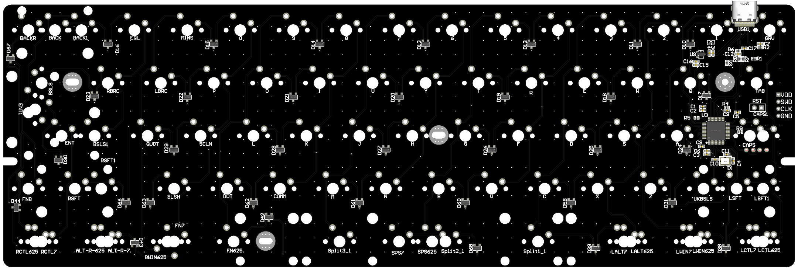
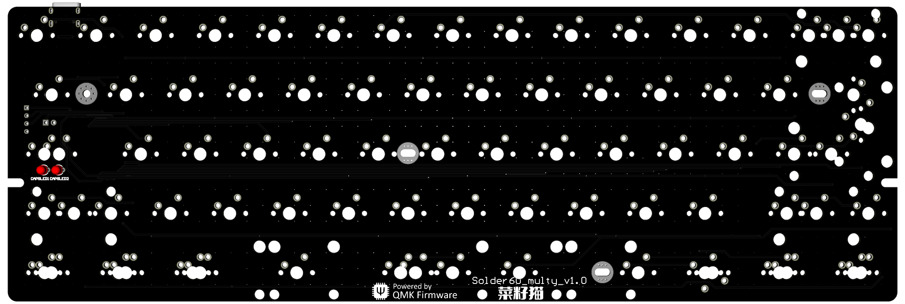
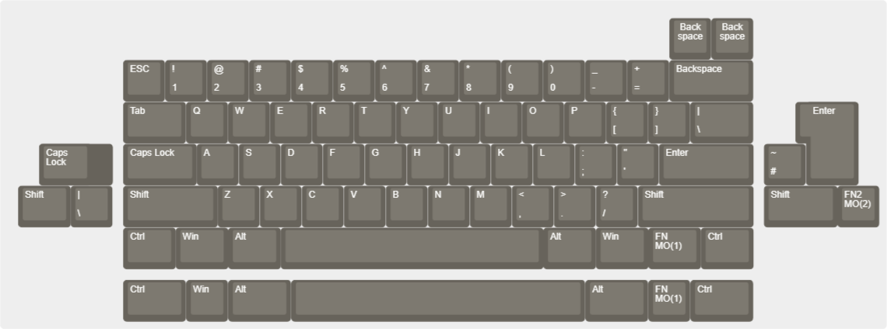

# czmao made in China

### Based on QMK firmware, VIA enable，1.6mm PCB,GH 60 case

### 基于QMK，支持VIA，1.6mm PCB, GH60外壳可用，PCB卫星轴

### Solder only and no led（only caps_led）

### 只支持焊接方式，无LED，只有CAPS指示灯

### 配列图 Layout

Usevia.app or https://micahyy.github.io/ to use via

购买地址

https://item.taobao.com/item.htm?ft=t&id=918505214240&spm=a21dvs.23580594.0.0.1d292c1bFuXYcM&skuId=5787637988198