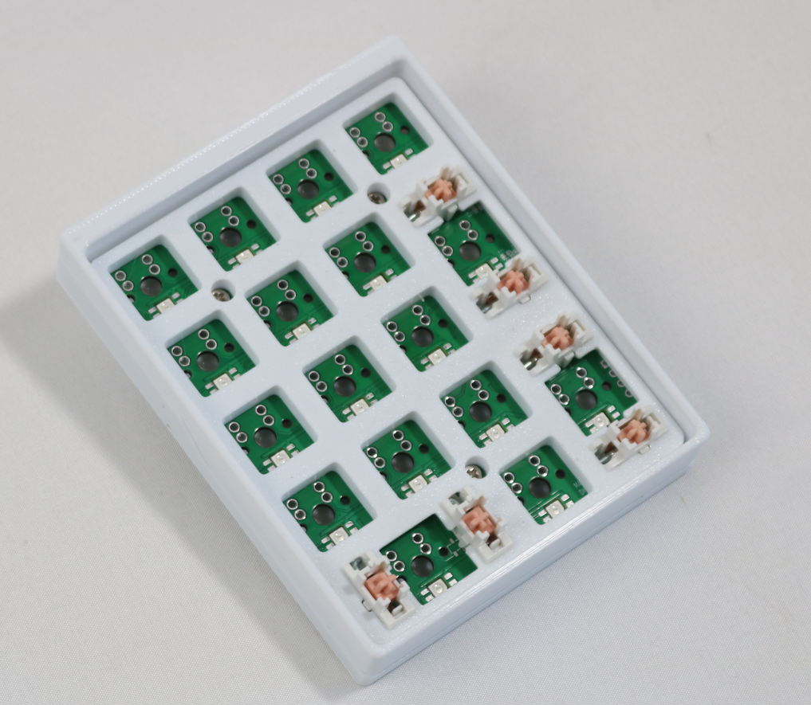
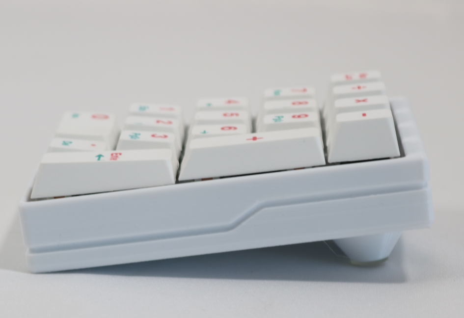

# DS17 USB QMK keyboard / DS17 有线单模QMK键盘
---
* Based on QMK, support VIA

    基于QMK制作，支持VIA

* 17keys number pad and mirrored left hand numberpad

    17键数字键盘，镜像左手键盘

* Solder design

    焊接版本

* 3D print case

    3D打印外壳

* RGB Matrix effect

    RGB_Matrix 灯效

* [taobao link](https://item.taobao.com/item.htm?ft=t&id=837130986899&sku_properties=122216346%3A21959%3B122216808%3A10491261) 

    [淘宝链接](https://item.taobao.com/item.htm?ft=t&id=837130986899&sku_properties=122216346%3A21959%3B122216808%3A10491261)

---

* 套餐一

    PCB bare board, without components, self prepared according to BOM, weld and burn

    PCB裸板，不含元器件，根据BOM自行备料焊接后烧录

* 套餐二

    PCB bare board+component package, self prepared according to BOM, welded and burned

    PCB裸板+元器件包，根据BOM自行备料焊接后烧录

* 套餐三

    SMT PCB, firmware burned, weld Keyboard axis and install keycaps to use

    贴片PCB，已烧录固件，到手焊轴安装键帽后可用

---

## update
