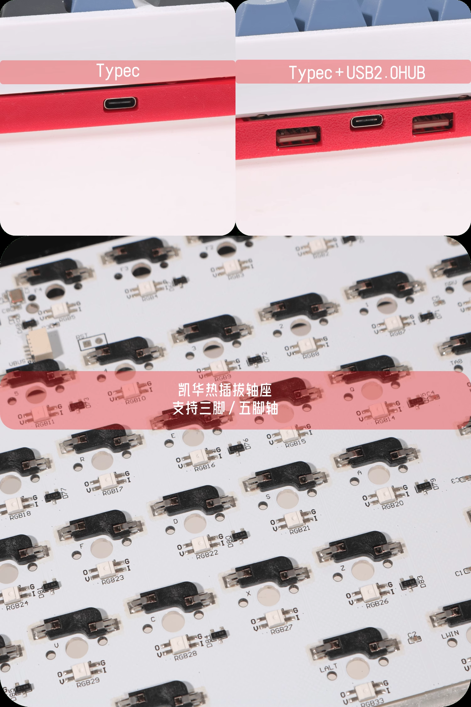

It's a keyboard with 34keys based on QMK firmware and 3D printed case

Lite version and USB 2.0 hub version

after 202506 pls use c23_ds34_v2.0

taobao link https://item.taobao.com/item.htm?ft=t&id=797002378382&sku_properties=122216346%3A21959%3B211004089%3A22770294353